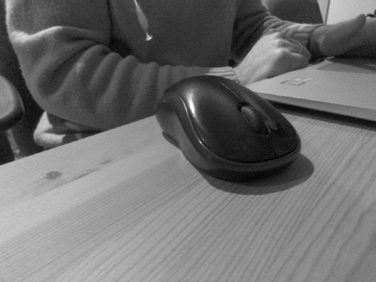
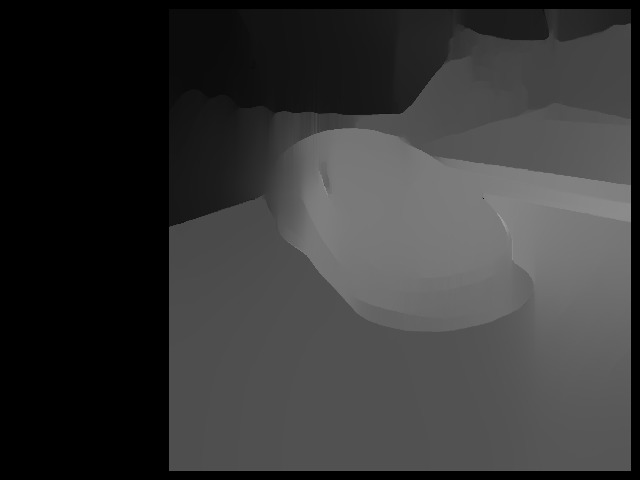

# Jetson-Stereo-CSI-Camera

## General Info
This is an OpenCV-based software-synchronised library for stereo CSI Camera.
The code has been tested using Waveshare's IMX219-83 Stereo Camera (https://www.waveshare.com/wiki/IMX219-83_Stereo_Camera) and Nvidia Jetson Nano with JetPack 4.4.1.
Test application allows to tune disparity map parameters.
The aim of this project is to perform as much stereo processing using OpenCV CUDA functions as possible.

## Requirements
* OpenCV 4.5 built with CUDA and Contrib repository.<br>
<b>Note:</b> OpenCV that comes with JetPack 4.4.1 is <b>not</b> built with CUDA. I recommend removing it and building fresh from source.
* This library uses POSIX calls for thread synchronisation.

## Setup
Default build without internal logging
```
$ mkdir build
$ cd build
$ cmake ..
$ make -j 3
$ ./test_CSI_Stereo
```
To build with additional logging, pass -DLOG=1 to cmake like:
```
$ cmake .. -DLOG=1
```
## Usage
After building there is a library which can be used in any project, and a test application. The test application allows to play around with disparity map parameters as well as allows to enable/disable disparity map filter. Median filter is still applied (see [Discussion](#discussion)). When running the test application, pressing space bar pauses image capturing and saves left, right, and disparity images to files (fixed name - will be overriden).

## Example
Left camera image:<br>
<br>
Filtered disparity map:<br>
<br>

## Discussion
There are several findings and implementation specifics which I would like to share:
* Software synchronisation is not perfect (bear in mind rolling shutter IMX219!) If you place a phone with running clock and take a snapshot, you may see different time on images from time to time. Still, it is better than nothing.
* Typically we would use 16-bit fixed-point or 32-bit floating-point type for a disparity map, however, CUDA implementation of OpenCV's stereo block matching converts the type to 8-bit fixed point. 
* Disparity map filtering is used from Contrib repository and currently there is no CUDA version of the filter. I put that onto my TODO list.
* By default I try to capture images at the highest resolution and then resize. Modes that provide lower resolution images but at faster frame rate crop them. This can be seen on the noise. When full-size images are resized, the noise is filtered a little bit so that improves image's quality.
* Because image noise was still substantial when diltering disparity map, I added median filter into the pipeline. It is applied after rectification and before disparity map creation.
* For running in 5W mode, processing 640x480 images is too much for Nano. However, resizing them further to 320x240 give a fairly good performance. The number of disparities needs to be reduced though.
